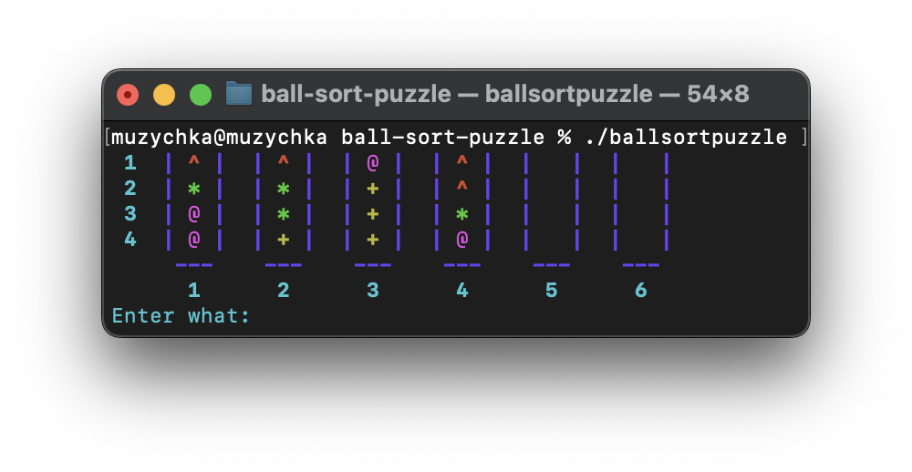
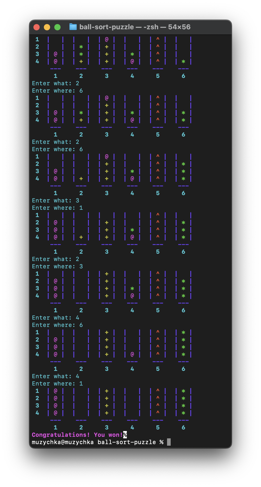

# 🎨 Ball Sort Puzzle Game

## 📜 Overview
This repository contains a C implementation of the Ball Sort Puzzle game. The game features a grid of colored balls and requires the player to sort the balls by color through a series of moves. The goal is to make each column contain balls of a single color.



## 📦 Files
- `ballsortpuzzle.h` - Header file with function declarations and constants.
- `style.h` - Header file with ANSI escape codes for terminal colors.
- `main.c` - Main implementation of the Ball Sort Puzzle game.
- `README.md` - Documentation file (this one).



## 🚀 How to Run

### Compile the Code
Use a C compiler like gcc:
```bash
gcc -o ballsortpuzzle ballsortpuzzle.c
```

### Run the Game
Execute the compiled program:
```bash
./ballsortpuzzle
```
## 🧩 Game Functions

- **generator**
  - **Purpose**: Generates the initial game field with random ball colors and two blank columns.
  - **Parameters**:
    - `rows` - Number of rows in the field.
    - `columns` - Number of columns in the field.
    - `field` - 2D array to hold the game field.

- **down_possible**
  - **Purpose**: Handles the movement of balls from one column to another.
  - **Parameters**:
    - `rows` - Number of rows in the field.
    - `columns` - Number of columns in the field.
    - `field` - 2D array to hold the game field.
    - `x` - Source column index.
    - `y` - Destination column index.

- **check**
  - **Purpose**: Checks if all columns in the game field contain balls of the same color.
  - **Parameters**:
    - `rows` - Number of rows in the field.
    - `columns` - Number of columns in the field.
    - `field` - 2D array to hold the game field.
  - **Returns**: `true` if the game is won (all columns are sorted), `false` otherwise.

- **game_field**
  - **Purpose**: Draws the current state of the game field to the console.
  - **Parameters**:
    - `rows` - Number of rows in the field.
    - `columns` - Number of columns in the field.
    - `field` - 2D array to hold the game field.

- **ball_sort_puzzle**
  - **Purpose**: Main function that runs the interactive ball sort puzzle game.
  - **Description**: Initializes the game field, displays the game state, and processes user input to move balls until the game is won.

## 🎨 Color Codes
The game uses ANSI escape codes for terminal colors. Here are the defined color codes:

- **Red**: `\x1b[31m`
- **Green**: `\x1b[32m`
- **Yellow**: `\x1b[33m`
- **Blue**: `\x1b[34m`
- **Magenta**: `\x1b[35m`
- **Cyan**: `\x1b[36m`
- **Reset**: `\x1b[0m`
- **Bold**: `\x1b[1m`
